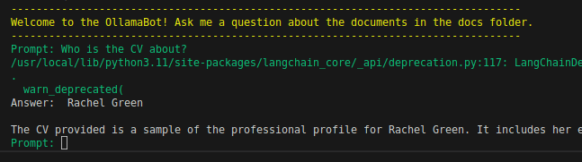

# Ollama QA | Fully Dockerized with Nvidia GPU Support

Ollama QA is an advanced chatbot designed for document-oriented inquiries. Utilizing the Retrieval-Augmented Generation (RAG) approach, it seamlessly integrates powerful language models, such as Llama 3.1 and Mistral AI, with information retrieval to deliver comprehensive responses. Ollama simplifies the deployment process by enabling local execution through a unified Modelfile package, ensuring efficient GPU utilization.

Explore the capabilities of Ollama at [Ollama's official blog](https://ollama.ai/blog/ollama-is-now-available-as-an-official-docker-image).

## 🚀 Why Choose Ollama?

Ollama empowers users to execute models locally, streamlining setup complexities and optimizing GPU usage. The Ollama model library offers a diverse range of supported models and variants.

Credits to [Ollama](https://ollama.ai/blog/ollama-is-now-available-as-an-official-docker-image).

## 📝 Nvidia CUDA

NVIDIA CUDA is a robust platform and programming model, unlocking the computational power of GPUs. Its key features include extending standard programming languages, supporting CPU-GPU heterogeneous computing, and efficient parallel processing.

```yaml
  qa_ollama_server:
    ...
    deploy:
      resources:
        reservations:
          devices:
            - driver: nvidia
              count: 1
              capabilities: [gpu]

```

Credits to [NVIDIA](https://developer.nvidia.com/cuda-zone) for CUDA.

## ⚙️ Requirements

* [Docker](https://docs.docker.com/get-docker/)
* [NVIDIA Container Toolkit Installation](https://docs.nvidia.com/datacenter/cloud-native/container-toolkit/1.14.3/install-guide.html)
* A good PC with a good GPU :)

## 🚀 Getting Started

1. Clone the repository.
2. Install the model and Python requirements.

```bash
make setup
```

## 🚀 Launch

Initiate the multi-document chatbot to interact with your files. Place relevant files in the /docs directory. To exit, simply enter 'q'.

```bash
make run
```



## 🚀 Deep dive

* [Youtube screencast](https://www.youtube.com/watch?v=-au5fqLUsCw)

## 📝 References

* [Ollama](https://ollama.ai/blog/ollama-is-now-available-as-an-official-docker-image)
* [NVIDIA](https://developer.nvidia.com/cuda-zone)
* [Docker](https://docs.docker.com/get-docker/)
* [NVIDIA Container Toolkit Installation](https://docs.nvidia.com/datacenter/cloud-native/container-toolkit/1.14.3/install-guide.html)
* [Mistral AI](https://mistral.ai/news/mixtral-of-experts/)
